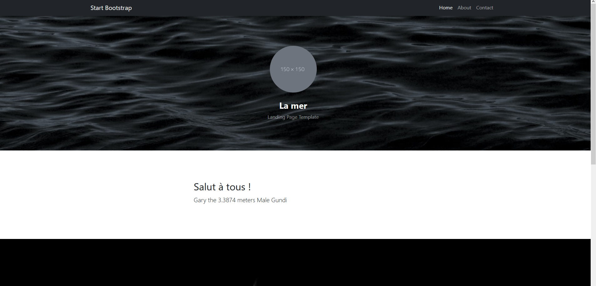

# RES - Laboratoire HTTP Infra

## Etape 1 - Serveur statique

Dans cette étape nous allons configurer un serveur HTTP statique avec une image Docker et une page HTML basique. Nous avons utilisé un [template](https://startbootstrap.com/template/full-width-pics) du framework Bootstrap.

### Contenu

Voici le contenu du Dockerfile :

```dockerfile
FROM php:7.4-apache
RUN apt-get update && \
   apt-get install -y vim
COPY content/ /var/www/html/
```

Nous construisons notre image sur la base d'une image Apache php et la version 7.4. Ensuite, on copie le contenu du dossier content, qui contient les informations du site statique, dans le dossier /var/www/html/ de l'image Docker.

### Utilisation

Pour lancer le container, il faut se trouver dans le répertoire `apache-php-image` et entrer les commande : `docker build -t res/apache_static .` pour construire l'image et `docker run -d -p 9090:80 res/site-static` pour lancer le container. Pour accéder au site, il faut ouvrir un navigateur et d'entrer comme URL : `localhost:9090`.

## Etape 2 - Serveur dynamique

Dans cette étape, nous implémentons une application dynamique qui retourne des données en plus du contenu HTML. Pour cela, nous utilisons Node.js, ainsi qu'une image Docker. 

### Contenu

Les données sont celles du script `index.js` qui génère une liste aléatoire d'animaux et la renvoie sous forme de tableau avec Chancejs.

Le Dockerfile :

```dockerfile
FROM node:14.17.0
COPY src /opt/app
RUN apt-get update && \
   apt-get install -y vim
CMD ["node", "/opt/app/index.js"]
```

Comme à l'étape 1, nous nous basons sur une image déjà existante, celle de node en version 14.17.0, puis copions le contenu de src/ dans /opt/app. La dernière ligne fait en sorte que le script `index.js` s'exécute à chaque lancement du container.

### Utilisation

En se trouvant dans le dossier `express-image`, entrer la commande `docker build -t res/express .` pour construire l'image, et `docker run -p 8080:3000 res/express`. Pour accéder au site, 

Pour accéder au site, il faut ouvrir un navigateur et d'entrer comme URL : `localhost:9090`.

## Etape 3 - Reverse proxy

Dans cette étape, nous avons mis en place un reverse proxy avec apache et Docker. Il sera dans un container séparé.

### Contenu 

Il y a deux fichiers de configuration, `000-default.conf`et `001-reverse-proxy.conf`, qui indiquent la configuration du serveur proxy.

```php
<VirtualHost *:80>
        ServerName demo.res.ch

        #ErrorLog ${APACHE_LOG_DIR}/error.log
        #CustomLog ${APACHE_LOG_DIR}/access.log combined
		
		ProxyPass "/api/animals/" "http://172.17.0.3:3000/"
        ProxyPassReverse "/api/animals/" "http://172.17.0.3:3000/"

        ProxyPass "/" "http://172.17.0.2:80/"
        ProxyPassReverse "/" "http://172.17.0.2:80/"

</VirtualHost>
```


Il y a aussi un Dockerfile :

```dockerfile
FROM php:7.4-apache
RUN apt-get update && \
   apt-get install -y vim
COPY conf/ /etc/apache2
RUN a2enmod proxy proxy_http
RUN a2ensite 000-* 001-*
```

Nous utilisons la même image php qu'à l'étape 1. On installe vim dans l'image, puis copie le contenu du dossier conf, qui contient donc la configuration du reverse proxy, dans le dossier /etc/apache2 de l'image Docker. Les commandes RUN permettent d'activer des modules apache nécessaires à la configuration du proxy.

### Utilisation

Puisque le reverse est encore statique, il faut lancer les containers dans le bon ordre afin qu'ils aient les bonnes adresses IP avec les commande suivantes, après avoir construit les images aux étapes précédentes :

`docker run -d res/apache_static`

`docker run -d res/express`

Puis, depuis le répertoire `apache-reverse-proxy`, on build l'image 

`docker build -t res/apache_rp .`

Et on lance le container

`docker run -p 8080:80 -d res/apache_rp`

Pour accéder au site, ouvrir un navigateur et entrer dans l'URL `demo.res.ch:8080/`.

Pour accéder a l'application dynamique, entrer `demo.res.ch:8080/api/animals`. 

## Etape 4 - Requêtes AJAX

Dans cette étape, nous allons utiliser la librairie JQuery afin d'envoyer périodiquement des requêtes AJAX vers le server dynamique afin de mettre à jour la page statique. 

### Contenu

Nous avons écrit un script `animals.js`, qui fait la même chose que celui de l'étape 2, et qui affiche les informations du premier élément du tableau. Ces données sont re-générées toutes les 5 secondes. Pour que le site exécute ce script, il a fallut ajouter la ligne `<script src="js/animals.js"></script>` dans le code du site statique, fichier **index.html** .  Nous obtenons la librairies jQuery avec la ligne ```<script src="https://ajax.googleapis.com/ajax/libs/jquery/3.5.1/jquery.min.js"></script>``` .

### Utilisation

Comme à l'étape précédente, il faut que les containers soient lancés dans le même ordre. Après les avoir tous arrêtés, entrer les commandes suivantes : 

En étant dans le répertoire `apache-php-image` 

`docker build -t res/apache_static .` et `docker run -d res/apache_static`

En étant de le répertoire `express-image`

`docker build -t res/express .` et `docker run -d res/express` 

En étant dans le répertoire `apache-reverse-proxy`

 `docker build -t res/apache_rp .` et `docker run -p 8080:80 -d res/apache_rp`

Ensuite, ouvrir un navigateur et entrer dans l'URL `demo.res.ch:8080/`.

## Etape 5 - Dynamic reverse proxy configuration

### Contenu

Dans cette étape, nous avons commencer par créer un dossier templates dans lequel nous mettrons les script de configurations à passer au serveur proxy. Dans ce dossier, nous créons le fichier **config-template.php**. Ce script permettra de récupérer l'addresse ip des containers depuis des variables d'environnement, puis de les ajouter à la configuration de notre proxy. Voici le **config-template.php**

```php
<?php
    $ip_static = getenv('STATIC_APP');
    $ip_dynamic = getenv('DYNAMIC_APP');
?>

<VirtualHost *:80>
        ServerName demo.res.ch

		ProxyPass '/api/animals/' 'http://<?php print "$ip_dynamic"?>/'
        ProxyPassReverse '/api/animals/' 'http://<?php print "$ip_dynamic"?>/'

        ProxyPass "/" "http://<?php print "$ip_static"?>/"
        ProxyPassReverse "/" "http://<?php print "$ip_static"?>/"

</VirtualHost>
```

Le script **apache2-foreground** nous permet d'utiliser les variables d'environnement dans le containers proxy. Il a été récupéré [ici](https://github.com/docker-library/php/blob/47e681a74116da5a99e804bef5a7808df40d831f/7.4/buster/apache/apache2-foreground). Nous y ajoutons la ligne ```php /var/apache2/templates/config-template.php > /etc/apache2/sites-available/001-reverse-proxy.conf``` pour run notre script php et écraser le contenu du fichier 001-revevrse-proxy.conf avec son résultat.

Le script complet final :

```bash
#!/bin/bash
set -e

# Note: we don't just use "apache2ctl" here because it itself is just a shell-script wrapper around apache2 which provides extra functionality like "apache2ctl start" for launching apache2 in the background.
# (also, when run as "apache2ctl <apache args>", it does not use "exec", which leaves an undesirable resident shell process)

: "${APACHE_CONFDIR:=/etc/apache2}"
: "${APACHE_ENVVARS:=$APACHE_CONFDIR/envvars}"
if test -f "$APACHE_ENVVARS"; then
	. "$APACHE_ENVVARS"
fi
echo "Static app URL: $STATIC_APP"
echo "Dynamic app URL: $DYNAMIC_APP"
php /var/apache2/templates/config-template.php > /etc/apache2/sites-available/001-reverse-proxy.conf
# Apache gets grumpy about PID files pre-existing
: "${APACHE_RUN_DIR:=/var/run/apache2}"
: "${APACHE_PID_FILE:=$APACHE_RUN_DIR/apache2.pid}"
rm -f "$APACHE_PID_FILE"

# create missing directories
# (especially APACHE_RUN_DIR, APACHE_LOCK_DIR, and APACHE_LOG_DIR)
for e in "${!APACHE_@}"; do
	if [[ "$e" == *_DIR ]] && [[ "${!e}" == /* ]]; then
		# handle "/var/lock" being a symlink to "/run/lock", but "/run/lock" not existing beforehand, so "/var/lock/something" fails to mkdir
		#   mkdir: cannot create directory '/var/lock': File exists
		dir="${!e}"
		while [ "$dir" != "$(dirname "$dir")" ]; do
			dir="$(dirname "$dir")"
			if [ -d "$dir" ]; then
				break
			fi
			absDir="$(readlink -f "$dir" 2>/dev/null || :)"
			if [ -n "$absDir" ]; then
				mkdir -p "$absDir"
			fi
		done

		mkdir -p "${!e}"
	fi
done

exec apache2 -DFOREGROUND "$@" 
```

Il faut maintenant modifier le Dockerfile du proxy pour copier le contenu du dossier templates  ainsi que le fichier apache-foreground sur le serveur. Pour cela, on ajoute les lignes 

```dockerfile
COPY apache2-foreground /usr/local/bin/
COPY templates /var/apache2/templates
```

### Utilisation

Les containers doivent toujours être lancés dans le bon ordre, mais le lancement du proxy est différent . Il faut maintenant intégrer l'adresse ip des containers sous la forme de variables d'environnement lors de la commande run. Les noms des variables doivent correspondre à ce que l'on a mis dans le script config-template.php. Pour faire cela, on utilise l'option -e de la commande ```run``` docker.

On lance donc le reverse proxy en dernier selon le pattern :

```bash
docker run -d -e DYNAMIC_APP=172.17.0.2:3000 -e  STATIC_APP=172.17.0.4:80 -e -p 8081:80 --name apache_rp res/apache_rp

```

En accédant a ```demo.res.ch:8081/``` on peut voir le nom des animaux défiler.




## Bonus : Load balancing, multiple server nodes

Pour réaliser ce bonus, nous avons du modifier le Dockerfile du reverse proxy pour activer les modules ```proxy_balancer``` et  ```lbmethod_byrequests```. Nous avons donc modifié la ligne ```RUN a2enmod proxy proxy_http```.

```dockerfile
FROM php:7.4-apache

RUN apt-get update && \
	apt-get install -y vim

COPY apache2-foreground /usr/local/bin/
copy templates /var/apache2/templates
COPY conf/ /etc/apache2

RUN a2enmod proxy proxy_http proxy_balancer lbmethod_byrequests
RUN a2ensite 000-* 001-*
```

Ensuite, nous avons du modifier le ```config-template.php``` afin de configurer le load balancer et les clusters.

```php
<?php
    $ip_static = getenv('STATIC_APP');
    $ip_static_1 = getenv('STATIC_APP1');
    $ip_dynamic = getenv('DYNAMIC_APP');
    $ip_dynamic_1 = getenv('DYNAMIC_APP1');
?>


<VirtualHost *:80>
        ServerName demo.res.ch
		<Proxy "balancer://cluster_appDynamic">
            BalancerMember "http://<?php print "$ip_dynamic"?>"
            BalancerMember "http://<?php print "$ip_dynamic_1"?>"
        </Proxy>

        <Proxy "balancer://cluster_appStatic">
            BalancerMember "http://<?php print "$ip_static"?>"
            BalancerMember "http://<?php print "$ip_static_1"?>"
        </Proxy>

		ProxyPass '/api/animals/' 'balancer://cluster_appDynamic/'
        ProxyPassReverse '/api/animals/' 'balancer://cluster_appDynamic/'

        ProxyPass "/" "balancer://cluster_appStatic/"
        ProxyPassReverse "/" "balancer://cluster_appStatic/"

</VirtualHost>
```

Il y deux clusters, un pour l'application static et l'autre pour la dynamique. Nous avons mis deux membres dans chaque clusters donc jusqu'à deux containers de chaque application peuvent être gérés en même temps.

Pour tester notre implémentation, nous avons encore ajouté un ```balancer-manager``` qui nous permet de voir quelle adresse est utilisée.

Le Dockerfile doit activer le module ```status```.

```dockerfile
FROM php:7.4-apache

RUN apt-get update && \
	apt-get install -y vim

COPY apache2-foreground /usr/local/bin/
copy templates /var/apache2/templates
COPY conf/ /etc/apache2

RUN a2enmod proxy proxy_http proxy_balancer lbmethod_byrequests status
RUN a2ensite 000-* 001-*
```

Et le ```config-template.php``` ajoute le balancer manager avec la balise Location et la directive ProxyPass.

```php
<?php
    $ip_static = getenv('STATIC_APP');
    $ip_static_1 = getenv('STATIC_APP1');
    $ip_dynamic = getenv('DYNAMIC_APP');
    $ip_dynamic_1 = getenv('DYNAMIC_APP1');
?>


<VirtualHost *:80>
        ServerName demo.res.ch
		<Proxy "balancer://cluster_appDynamic">
            BalancerMember "http://<?php print "$ip_dynamic"?>"
            BalancerMember "http://<?php print "$ip_dynamic_1"?>"
        </Proxy>

        <Proxy "balancer://cluster_appStatic">
            BalancerMember "http://<?php print "$ip_static"?>"
            BalancerMember "http://<?php print "$ip_static_1"?>"
        </Proxy>

        <Location "/balancer-manager">
            SetHandler balancer-manager
        </Location>

        ProxyPass '/balancer-manager' !
		ProxyPass '/api/animals/' 'balancer://cluster_appDynamic/'
        ProxyPassReverse '/api/animals/' 'balancer://cluster_appDynamic/'

        ProxyPass "/" "balancer://cluster_appStatic/"
        ProxyPassReverse "/" "balancer://cluster_appStatic/"
</VirtualHost>
```


On voit avec la colonne Elected de chaque cluster que les deux worker sont utilisés. Le path montre quel endpoint est choisi.

## Bonus : Load balancing, round-robin vs sticky sessions 

En partant de notre implémentation du load balancing en round-robin uniquement, nous avons ajouté le module ```headers``` au Dockerfile et modifié le config-template comme suit :

```php
<?php
    $ip_static = getenv('STATIC_APP');
    $ip_static_1 = getenv('STATIC_APP1');
    $ip_dynamic = getenv('DYNAMIC_APP');
    $ip_dynamic_1 = getenv('DYNAMIC_APP1');
?>


<VirtualHost *:80>
        ServerName demo.res.ch
		<Proxy "balancer://cluster_appDynamic">
            BalancerMember "http://<?php print "$ip_dynamic"?>"
            BalancerMember "http://<?php print "$ip_dynamic_1"?>"
        </Proxy>

        Header add Set-Cookie "ROUTEID=.%{BALANCER_WORKER_ROUTE}e; path=/" env=BALANCER_ROUTE_CHANGED
        <Proxy "balancer://cluster_appStatic">
            BalancerMember "http://<?php print "$ip_static"?>" route=1
            BalancerMember "http://<?php print "$ip_static_1"?>" route=2
            ProxySet stickysession=ROUTEID
        </Proxy>

        <Location "/balancer-manager">
            SetHandler balancer-manager
        </Location>

        ProxyPass '/balancer-manager' !

		ProxyPass '/api/animals/' 'balancer://cluster_appDynamic/'
        ProxyPassReverse '/api/animals/' 'balancer://cluster_appDynamic/'

        ProxyPass "/" "balancer://cluster_appStatic/"
        ProxyPassReverse "/" "balancer://cluster_appStatic/"

</VirtualHost>
```

On test pour valider l'implémentation :


On voit que le cluster dynamique travaille toujours en Round-Robin, les deux worker sont utilisés tour à tour. Le cluster par contre possède maintenant une sticky session et on voit que c'est toujours le même worker qui est selectionné, ce qui est correct. 

On peut également aller regarder à l'aide des developper tools le cookie qui nous a été attribué :


Si on éteint le serveur statique avec la route 2, on peut voir que le cookie change :


Pour les bonus de load-balancing, nous nous sommes basés sur les infos de [apache](https://httpd.apache.org/docs/2.4/fr/mod/mod_proxy_balancer.html)

## Bonus : Management UI

Tout d'abord, nous avons créé un script pour lancer toute l'infrastructure des serveurs automatiquement. Le script se nomme ``launchServers.sh``. Pour implémenter le management UI, nous avons utilisé l'outil ```Portrainer```. Nous avons du ajouter à la fin de notre script les lignes :

```bash
docker volume create portainer_data
docker run -d -p 8000:8000 -p 9000:9000 --name=portainer --restart=always -v /var/run/docker.sock:/var/run/docker.sock -v portainer_data:/data portainer/portainer-ce
```

Ces commandes sont en commentaires dans le script et doivent être décommentées si vous utilisez Linux. Sous windows, après avoir lancer le script launchServers.sh, il faut ouvrir un terminal Powershell en administrateur, puis run les deux commandes commentées dans le fichier.

L'UI est disponible à l'adresse ```localhost:9000/``` . Voici le résultat :

