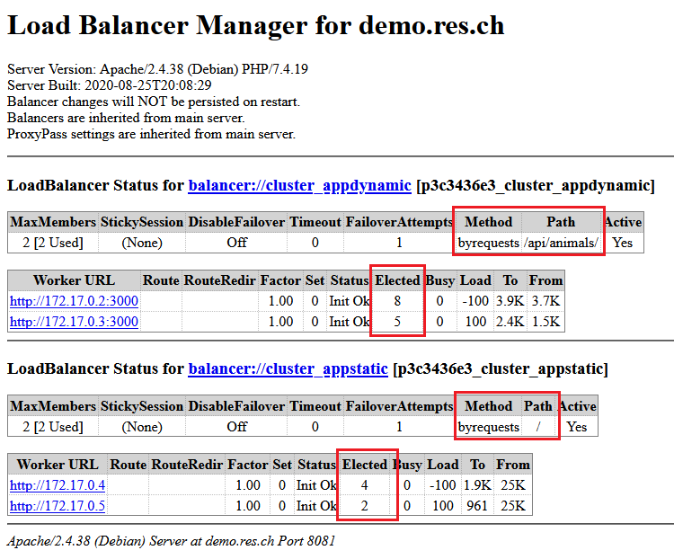
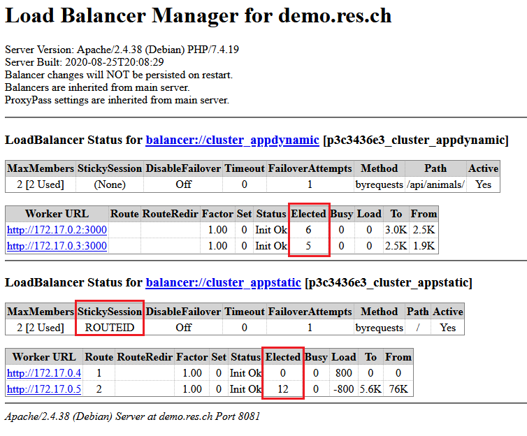
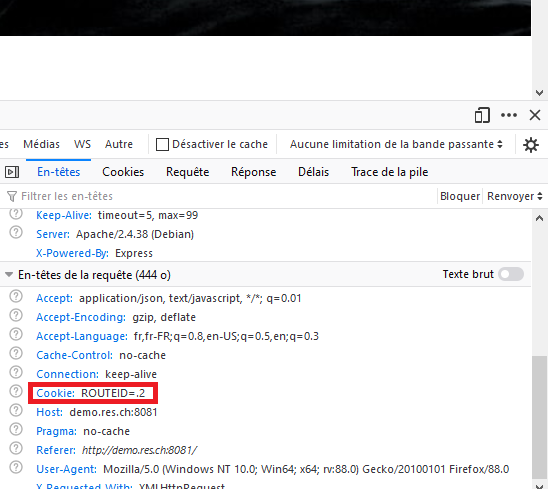
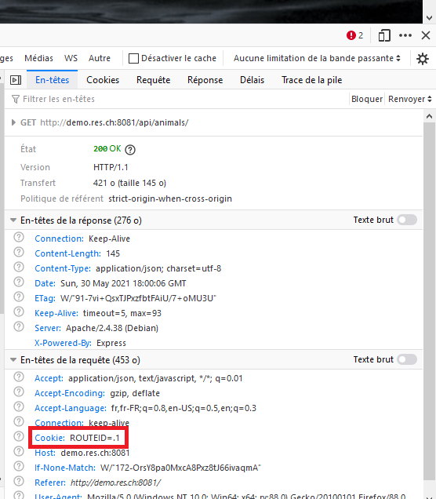
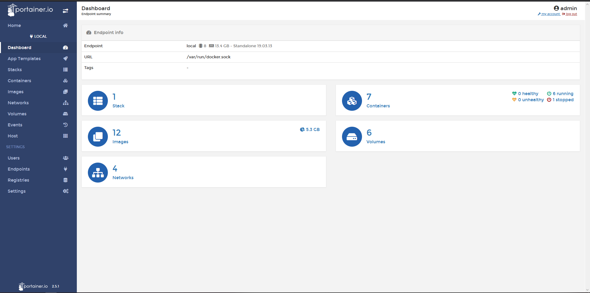

# RES-Labo-HTTPInfra

## Bonus : Load balancing, multiple server nodes

Pour réaliser ce bonus, nous avons du modifier le Dockerfile du reverse proxy pour activer les modules ```proxy_balancer``` et  ```lbmethod_byrequests```. Nous avons donc modifié la ligne ```RUN a2enmod proxy proxy_http```.

```dockerfile
FROM php:7.4-apache

RUN apt-get update && \
	apt-get install -y vim

COPY apache2-foreground /usr/local/bin/
copy templates /var/apache2/templates
COPY conf/ /etc/apache2

RUN a2enmod proxy proxy_http proxy_balancer lbmethod_byrequests
RUN a2ensite 000-* 001-*
```

Ensuite, nous avons du modifier le ```config-template.php``` afin de configurer le load balancer et les clusters.

```php
<?php
    $ip_static = getenv('STATIC_APP');
    $ip_static_1 = getenv('STATIC_APP1');
    $ip_dynamic = getenv('DYNAMIC_APP');
    $ip_dynamic_1 = getenv('DYNAMIC_APP1');
?>


<VirtualHost *:80>
        ServerName demo.res.ch
		<Proxy "balancer://cluster_appDynamic">
            BalancerMember "http://<?php print "$ip_dynamic"?>"
            BalancerMember "http://<?php print "$ip_dynamic_1"?>"
        </Proxy>

        <Proxy "balancer://cluster_appStatic">
            BalancerMember "http://<?php print "$ip_static"?>"
            BalancerMember "http://<?php print "$ip_static_1"?>"
        </Proxy>

		ProxyPass '/api/animals/' 'balancer://cluster_appDynamic/'
        ProxyPassReverse '/api/animals/' 'balancer://cluster_appDynamic/'

        ProxyPass "/" "balancer://cluster_appStatic/"
        ProxyPassReverse "/" "balancer://cluster_appStatic/"

</VirtualHost>
```

Il y deux clusters, un pour l'application static et l'autre pour la dynamique. Nous avons mis deux membres dans chaque clusters donc jusqu'à deux containers de chaque application peuvent être gérés en même temps.

Pour tester notre implémentation, nous avons encore ajouté un ```balancer-manager``` qui nous permet de voir quelle adresse est utilisée.

Le Dockerfile doit activer le module ```status```.

```dockerfile
FROM php:7.4-apache

RUN apt-get update && \
	apt-get install -y vim

COPY apache2-foreground /usr/local/bin/
copy templates /var/apache2/templates
COPY conf/ /etc/apache2

RUN a2enmod proxy proxy_http proxy_balancer lbmethod_byrequests status
RUN a2ensite 000-* 001-*
```

Et le ```config-template.php``` ajoute le balancer manager avec la balise Location et la directive ProxyPass.

```php
<?php
    $ip_static = getenv('STATIC_APP');
    $ip_static_1 = getenv('STATIC_APP1');
    $ip_dynamic = getenv('DYNAMIC_APP');
    $ip_dynamic_1 = getenv('DYNAMIC_APP1');
?>


<VirtualHost *:80>
        ServerName demo.res.ch
		<Proxy "balancer://cluster_appDynamic">
            BalancerMember "http://<?php print "$ip_dynamic"?>"
            BalancerMember "http://<?php print "$ip_dynamic_1"?>"
        </Proxy>

        <Proxy "balancer://cluster_appStatic">
            BalancerMember "http://<?php print "$ip_static"?>"
            BalancerMember "http://<?php print "$ip_static_1"?>"
        </Proxy>

        <Location "/balancer-manager">
            SetHandler balancer-manager
        </Location>

        ProxyPass '/balancer-manager' !
		ProxyPass '/api/animals/' 'balancer://cluster_appDynamic/'
        ProxyPassReverse '/api/animals/' 'balancer://cluster_appDynamic/'

        ProxyPass "/" "balancer://cluster_appStatic/"
        ProxyPassReverse "/" "balancer://cluster_appStatic/"
</VirtualHost>
```



On voit avec la colonne Elected de chaque cluster que les deux worker sont utilisés. Le path montre quel endpoint est choisi.

## Bonus : Load balancing, round-robin vs sticky sessions 

En partant de notre implémentation du load balancing en round-robin uniquement, nous avons ajouté le module ```headers``` au Dockerfile et modifié le config-template comme suit :

```php
<?php
    $ip_static = getenv('STATIC_APP');
    $ip_static_1 = getenv('STATIC_APP1');
    $ip_dynamic = getenv('DYNAMIC_APP');
    $ip_dynamic_1 = getenv('DYNAMIC_APP1');
?>


<VirtualHost *:80>
        ServerName demo.res.ch
		<Proxy "balancer://cluster_appDynamic">
            BalancerMember "http://<?php print "$ip_dynamic"?>"
            BalancerMember "http://<?php print "$ip_dynamic_1"?>"
        </Proxy>

        Header add Set-Cookie "ROUTEID=.%{BALANCER_WORKER_ROUTE}e; path=/" env=BALANCER_ROUTE_CHANGED
        <Proxy "balancer://cluster_appStatic">
            BalancerMember "http://<?php print "$ip_static"?>" route=1
            BalancerMember "http://<?php print "$ip_static_1"?>" route=2
            ProxySet stickysession=ROUTEID
        </Proxy>

        <Location "/balancer-manager">
            SetHandler balancer-manager
        </Location>

        ProxyPass '/balancer-manager' !

		ProxyPass '/api/animals/' 'balancer://cluster_appDynamic/'
        ProxyPassReverse '/api/animals/' 'balancer://cluster_appDynamic/'

        ProxyPass "/" "balancer://cluster_appStatic/"
        ProxyPassReverse "/" "balancer://cluster_appStatic/"

</VirtualHost>
```

On test pour valider l'implémentation :



On voit que le cluster dynamique travaille toujours en Round-Robin, les deux worker sont utilisés tour à tour. Le cluster par contre possède maintenant une sticky session et on voit que c'est toujours le même worker qui est selectionné, ce qui est correct. 

On peut également aller regarder à l'aide des developper tools le cookie qui nous a été attribué :



Si on éteint le serveur statique avec la route 2, on peut voir que le cookie change :



Pour les bonus de load-balancing, nous nous sommes basés sur les infos de [apache](https://httpd.apache.org/docs/2.4/fr/mod/mod_proxy_balancer.html)

## Bonus : Management UI

Tout d'abord, nous avons créé un script pour lancer toute l'infrastructure des serveurs automatiquement. Le script se nomme ``launchServers.sh``. Pour implémenter le management UI, nous avons utilisé l'outil ```Portrainer```. Nous avons du ajouter à la fin de notre script les lignes :

```bash
docker volume create portainer_data
docker run -d -p 8000:8000 -p 9000:9000 --name=portainer --restart=always -v /var/run/docker.sock:/var/run/docker.sock -v portainer_data:/data portainer/portainer-ce
```

Ces commandes sont en commentaires dans le script et doivent être décommentées si vous utilisez Linux. Sous windows, après avoir lancer le script launchServers.sh, il faut ouvrir un terminal Powershell en administrateur, puis run les deux commandes commentées dans le fichier.

L'UI est disponible à l'adresse ```localhost:9000/``` . Voici le résultat :

